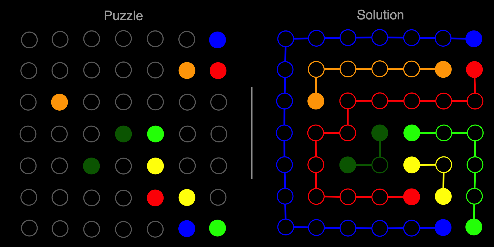

# flow-solver

Solving the [Flow Free](https://en.wikipedia.org/wiki/Flow_Free) puzzle game with
Clojure and SAT.

See the [write-up](https://torvaney.github.io/projects/flow-solver.html) for more.

## Usage

Run with `lein run path/to/spec.edn`. See example map specifications in
`resources/examples`.
